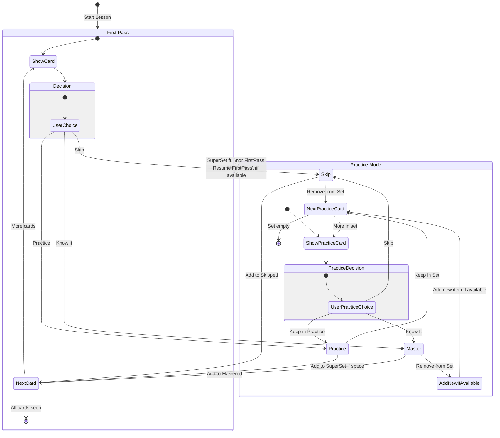

# PRD

## Overview

Active Recall is an AI-based practice app designed to optimize information retention through spaced repetition and active recall principles. The app uses flashcards as its primary learning mechanism, enhanced by AI-generated content and adaptive learning algorithms.

## Core Concept

The app cycles practice items (cards) through the user's working memory as frequently as possible, while intelligently managing time by filtering out mastered or unwanted information. This approach builds long-term memories effectively by strengthening neural connections through repeated recall.

## Key Features

### 1. Content Generation

- Users can input learning material through:
  - Direct text input (e.g., "I want to learn basic Thai")
  - Image upload (e.g., photo of a textbook page)
  - Text selection/copy-paste
- AI processes input to generate:
  - Structured outline of key facts
  - Memory connections and relationships
  - Mnemonics and learning aids
  - Flashcards for practice

### 2. Learning Flow

### First Pass

- Users see each card for the first time
- For each card, users choose:
  - "Know it" → Move to mastered
  - "Practice" → Add to practice set
  - "Skip" → Move to skipped

### Practice Mode

- Maintains an active practice set (default 4-5 cards, max 7)
- Practice set auto-fills when space is available
- Users can:
  - Keep cards in practice
  - Move cards to mastered
  - Skip cards
  - Move mastered cards back to practice if recall is weak

### Interleaved Learning

- Available after completing individual lessons
- Mixes cards from different lessons/categories
- Supports multiple learning strategies:
  - Random: Complete mixing
  - Balanced: Ensures even category distribution
  - Progressive: Gradually introduces new categories

### 3. Practice Set Management

- Size: 0-7 items
- Default: 4-5 items (testing with 4)
- User-adjustable via toggle
- Auto-fills when space becomes available
- Categories are spaced to prevent clustering

### 4. Session States

### Initial State

1. User provides learning material
2. AI generates study guide and cards
3. Begin first pass through cards

### First Pass

1. Show each card once
2. Build practice set based on user choices
3. Transition to practice mode when:
   - Practice set becomes full
   - All cards have been seen once

### Practice Mode

1. Cycle through practice set
2. Allow movement between mastered/practice states
3. Auto-fill with new cards when space available

### Completion

- When all cards are mastered or skipped:
  - Prompt for new lesson
  - Offer interleaved learning mode
  - Show progress statistics

## Technical Specifications

### Data Model

[See attached TypeScript definitions]

### State Machine



## User Interface Requirements

### Example Screens

!https://prod-files-secure.s3.us-west-2.amazonaws.com/6210981a-e646-493c-b833-014f8616af9a/ec377072-1660-4b6a-ad17-86decbdf30e9/image.png

!https://prod-files-secure.s3.us-west-2.amazonaws.com/6210981a-e646-493c-b833-014f8616af9a/0d612dbb-49ca-4959-8b62-12283341b108/image.png

!https://prod-files-secure.s3.us-west-2.amazonaws.com/6210981a-e646-493c-b833-014f8616af9a/1c4c855d-d8cb-47d1-a00b-c2af0f340049/image.png

!https://prod-files-secure.s3.us-west-2.amazonaws.com/6210981a-e646-493c-b833-014f8616af9a/a1cd3ee6-c712-4c20-8f26-29f7b87a867c/image.png

### Card Display

- Clear presentation of card content
- Support for text, images, and audio
- Pronunciation guides when applicable
- Easy-to-reach action buttons

### Practice Set Controls

- Visual indicator of practice set size
- Toggle for adjusting set size
- Clear indication of current mode (First Pass/Practice)
- Progress indicators

### Transitions

- Smooth transitions between modes
- Explanatory popups for mode changes
- Clear completion states
- Easy access to review statistics

## Future Considerations

- Optimal practice set size determination
- Time-of-day learning optimization
- Enhanced interleaving strategies
- Social learning features
- Progress sharing and competition
- Enhanced offline capabilities

## Data Model

```tsx
// Basic Types
type InterleaveStrategy = "random" | "balanced" | "progressive";
type RecallCategory = "unseen" | "skipped" | "mastered" | "practice";
type ConfidenceLevel = 1 | 2 | 3 | 4 | 5;
type CardSource = "practice" | "mastered" | "unseen";

// Card Structure
type CardSide = {
  markdown: string; // Can include text, images, audio via markdown syntax
  metadata?: {
    pronunciation?: string;
    notes?: string;
  };
};

// Practice Events and History
type PracticeEvent = {
  timestamp: number;
  result: RecallCategory;
  timeSpent: number; // milliseconds
  recalledSide: 0 | 1; // Index of the side being recalled
  confidenceLevel: ConfidenceLevel;
  isCorrect: boolean; // Self-reported accuracy
  attemptCount: number; // Times seen in this session
  sourceCategory: CardSource;
};

// Core Lesson Items
type LessonItem = {
  id: string;
  sides: [CardSide, CardSide];
  practiceHistory: PracticeEvent[];
  recallCategory: RecallCategory;
  createdAt: number;
  updatedAt: number;
  nextReviewDate?: Date;
  tags: string[];
  categories: string[]; // e.g. ['greetings', 'numbers', 'food']
  topicId?: string; // For broader groupings
  lastConfidenceLevel?: ConfidenceLevel;
  intervalModifier: number; // For SRS algorithm
};

// AI-Generated Study Materials
type StudyGuide = {
  id: string;
  lessonId: string;
  outline: Array<{
    fact: string;
    importance: number;
    relatedCards: string[]; // Card IDs
  }>;
  connections: Array<{
    cards: string[]; // Card IDs
    relationshipType: string;
    description: string;
  }>;
  mnemonics: Array<{
    cardIds: string[];
    technique: string;
    description: string;
  }>;
};

// Source Content
type SourceMaterial = {
  id: string;
  type: "text" | "image" | "audio";
  content: string; // Could be text or URL
  processed: boolean;
  extractedCards: string[]; // Card IDs
  language?: string;
  chapter?: string;
  topic?: string;
};

// Lesson Metadata
type LessonMetadata = {
  id: string;
  name: string;
  description: string;
  categories: string[];
  difficulty: "beginner" | "intermediate" | "advanced";
  estimatedTime: number; // minutes
  totalItems: number;
  version: number; // For data migrations
};

// Progress Tracking
type LessonProgress = {
  startedAt: number;
  lastAccessedAt: number;
  superSetIds: string[];
  superSetMaxLength: number;
  streakDays: number;
  bestStreak: number;
  totalTimeSpent: number;
  accuracyRate: number;
  recentlyShownCategories: Array<{
    category: string;
    timestamp: number;
  }>;
  stats: {
    unseen: number;
    skipped: number;
    mastered: number;
    practice: number;
  };
};

// Main Game State
type GameState = {
  // All available lessons (lazy loaded)
  lessonData: {
    [id: string]: {
      metadata: LessonMetadata;
      items?: LessonItem[]; // Optional until loaded
      syncStatus?: "synced" | "pending" | "conflict";
      studyGuide?: StudyGuide;
      sourceMaterial?: SourceMaterial;
    };
  };

  // Current active lesson state
  currentLesson: {
    id: string; // References lessonData
    progress: LessonProgress;
    items: LessonItem[];
  } | null;

  completedLessons: string[]; // Lesson IDs

  interleavedSessions?: {
    activeLessonIds: string[];
    superSetIds: string[];
    lastAccessed: number;
  };

  // Global settings
  settings: {
    defaultSuperSetSize: number;
    audioEnabled: boolean;
    interleaving: {
      enabled: boolean;
      strategy: InterleaveStrategy;
      minCategorySpacing: number; // Min cards between same category
    };
    srsSettings: {
      baseInterval: number; // Base time between reviews
      intervalModifier: number; // Global modifier for intervals
      failureSetback: number; // How much to reduce interval on failure
      masteredReviewFrequency?: number; // How often to show mastered cards
    };
    offlineMode: {
      enabled: boolean;
      maxCacheSize: number; // MB
    };
  };
};
```
